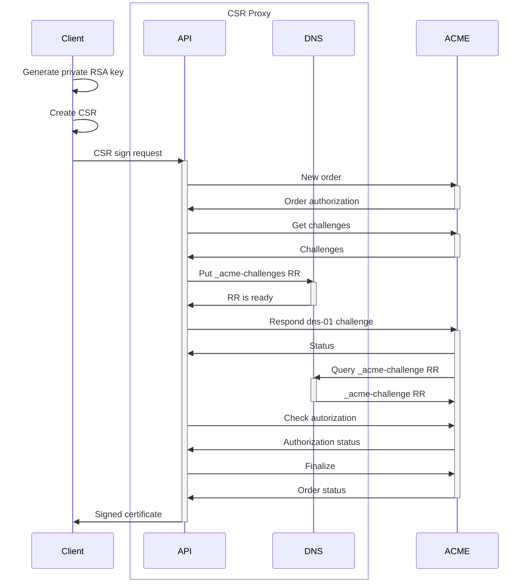

# CSR Proxy

*CSR Proxy is a simple service to sign the clients' CSR via the ACME server.*

---

**Documentation**: [https://docs.gufolabs.com/csr_proxy/](https://docs.gufolabs.com/csr_proxy/)

**Source Code**: [https://github.com/gufolabs/csr_proxy/](https://github.com/gufolabs/csr_proxy/)

---
The self-signed certificates are no longer sufficient, posing challenges in distributing trial and evaluation versions of software with web interfaces. To address this, software publishers typically consider the following options:

1. **Delegate Certificate Signing to the User:**

    - Pros: Gives control to advanced users.
    - Cons: Requires user knowledge of PKI, complex infrastructure, or additional expenses.

2. **Generate Self-Signed Certificate with mkcert:**

    - Pros: Suitable for developers.
    - Cons: Compromises system security, demands browser reloading, and adds complexity.

3. **Order a Certificate from Global CA:**

    - Pros: Secure, but expensive.
    - Cons: Violates TLS security principles by exposing the private key.

4. **Use `localhost.direct` Certificate or Similar Services:**

    - Pros: Similar to the previous approach.
    - Cons: Public exposure of the public key.

5. **Order Separate Certificates for Each User:**

    - Pros: Secure but time-consuming and costly.
    - Cons: Mutual trust issue; the publisher generates and knows the client's private key.

6. **Generate Client's Key and Certificate via ACME Server:**

    - Pros: Less expensive.
    - Cons: Mutual trust issue persists; the publisher generates and knows the client's private key.

7. **Negotiate with ACME Server from Client's Site:**

    - Pros: Reliable, but requires additional infrastructure setup.
    - Cons: Suitable for advanced users, not the default choice.

Considering the need for mutual trust and simplicity in software evaluation, 
the publisher should generate a private certificate on the user's side without touching it.
The published also needs to maintain all necessary infrastructure for the certificate signing.
Enter the CSR Proxy.

## CSR Proxy Overview

The CSR Proxy is a straightforward service executed on the publisher's side. It:

- Receives the Certificate Signing Request (CSR) from the client.
- Proxies the CSR to the ACME server for signing.
- Handles ACME challenge fulfillment, shielding the end user from complexity.

The sequence diagram is shown below. The primal parties are:

- **Client**: An entity demanding the certificate signing.

- **CSR Proxy**: The certificate signing service, consists of two parts:

    - **API**: The client-facing API, performing ACME interaction on behalf of the client. Also performs DNS provisioning.
    - **DNS**: PowerDNS service, providing a provisioning interface to API and serving DNS requests.

- **ACME**: Any RFC-8555 compatible ACME server, like Let's Encrypt.

## On Gufo Stack

This product is a part of [Gufo Stack][Gufo Stack] - the collaborative effort 
led by [Gufo Labs][Gufo Labs]. Our goal is to create a robust and flexible 
set of tools to create network management software and automate 
routine administration tasks.

To do this, we extract the key technologies that have proven themselves 
in the [NOC][NOC] and bring them as separate packages. Then we work on API,
performance tuning, documentation, and testing. The [NOC][NOC] uses the final result
as the external dependencies.

[Gufo Stack][Gufo Stack] makes the [NOC][NOC] better, and this is our primary task. But other products
can benefit from [Gufo Stack][Gufo Stack] too. So we believe that our effort will make 
the other network management products better.

[Gufo Labs]: https://gufolabs.com/
[Gufo Stack]: https://gufolabs.com/products/gufo-stack/
[NOC]: https://getnoc.com/
