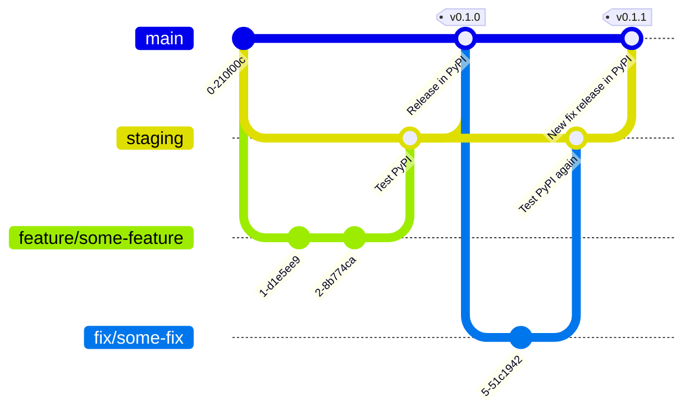

# Python package template

Template for Python packages for qurix Technology.

## Structure

A normal Python package will start with the namespace `qurix` as in this sample package. A sample structure is as follows:

```text
.
├── LICENCE
├── Makefile
├── README.md
├── qurix
│   └── <domain>
│       └── <module-organization-level>
│           ├── __init__.py
│           ├── __version__.py
│           └── <module>
├── requirements.txt
├── setup.py
└── tests
    ├── __init__.py
    └── test_client.py
```

## Versioning and release

Package versions will be identified according to [semantic versioning](https://semver.org/lang/en). The release process will deploy in both [Test PyPI](https://test.pypi.org/) and [PyPI](https://pypi.org/).



## Deployment

Using Github Actions. See `.github/worfklows/`

## Usage

Define a input data sources list (`.csv`) with following columns:

```csv
name,location,table_schema,table
```

Example

```csv
name,location,table_schema,table
source a,tests/resources/source_a.csv,,
source b,tests/resources/source_b.csv,,
```

Instantiate a data catalog client and point to that list

```python
from qurix.data.catalog.client import DataCatalogClient

client = DataCatalogClient(sources_list_path="sources.csv")

# or instantiate with an empty data catalog
client = DataCatalogClient()

# Load a certain data source with a data source name
data_source_a = client.get("source a")

# You can load data using extra arguments. This uses extra pandas data loading options.
# Example: 'source a' is a '.csv' location -> uses pd.read_csv(...)
data_source_a = client.get("source", sep=";", index_col=0)

# Export data catalog to local dir .catalog/metadata/catalog.csv
client.export()

# Load data from a previous session. It should be stored in .catalog/cache and .catalog/metadata
client.load_data()

# Add a new data source to the catalog
from qurix.data.catalog.entities import CatalogDataSource
new_data_source = CatalogDataSource(name="source a", location=str("some root" / "source_a.csv"))
client.add(new_data_source)
# Add a new Postgres data source to the catalog
from dotenv import load_dotenv
load_dotenv()
# Define the needed database credentials in the .env file: POSTGRES_USER, POSTGRES_PWD, POSTGRES_HOST, POSTGRES_PORT, POSTGRES_DB
new_data_source_postgres = CatalogDataSource(name="source b",
                                 location="postgresql://{POSTGRES_USER}:{POSTGRES_PWD}@{POSTGRES_HOST}:{POSTGRES_PORT}/{POSTGRES_DB}",
                                 table_schema="some_schema",
                                 table="some_table" 
                                 )
client.add(new_data_source_postgres, persist_metadata=True, cache_data=False)
# Add a new DB2 data source to the catalog
new_source_DB2 = CatalogDataSource(name="source c",
                                 location="ibm_db_sa://{DB2_USER}:{DB2_PWD}@{DB2_HOST}:{DB2_PORT}/{DB2_DB}",
                                 table_schema="some_schema",
                                 table="some_table" 
                                 )
client.add(new_source, persist_metadata=True, cache_data=False)


# Describe a data source
client.describe("source a")
"""
                   count data_type
column_name
Username               5    object
 Identifier            5     int64
One-time password      5    object
Recovery code          5    object
First name             5    object
Last name              5    object
Department             5    object
Location               5    object
"""
```
